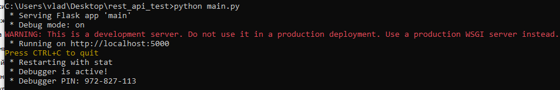
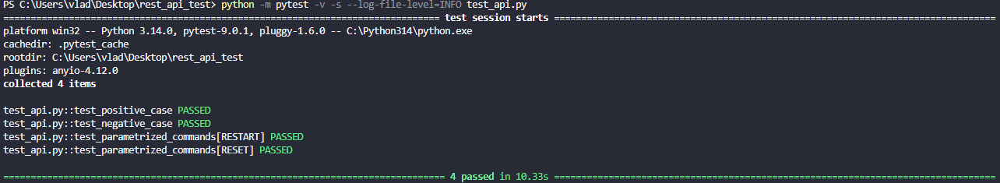
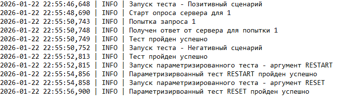

Main.py -           файл, содержайший программу имитации работы 
test_api.py -       файл теста (позитивный, негативный сценарии, параметризированный тест, логирование)
conftest.py -       файл, содержай фикстуры 
json_valid -        функции валидации Json

Запущенный сервер

 
Результат теста

Пример лога в файле

